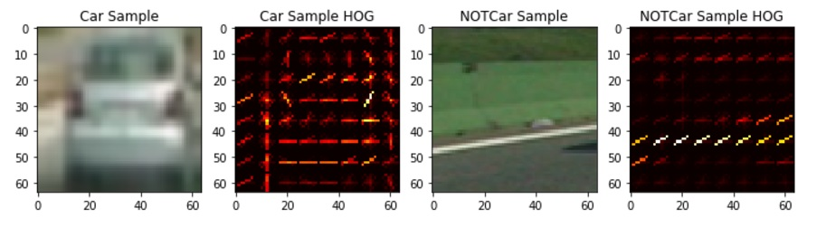
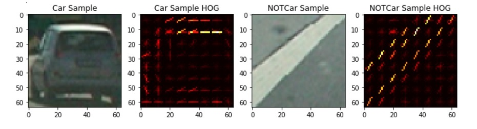
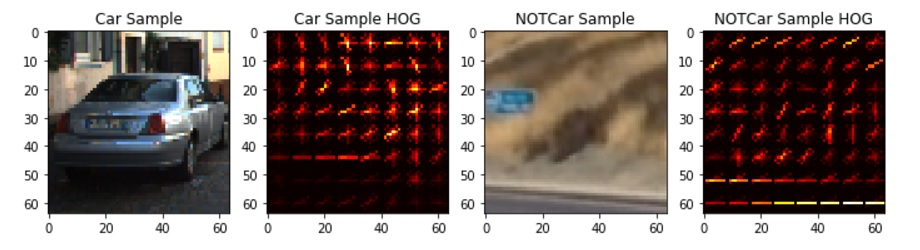

# Vehicle Detection and Tracking
**by Jean-Paul Wilson**

## Introduction

**[Link to Video](https://www.youtube.com/watch?v=XZyl9q-_iPA&feature=youtu.be)**

The following is a description of a pipeline implemented to detect vehicles in dashcam video. 
The mains steps involved include: 

i.) Import vehicle images and non-vehicle images.  
ii.) Extract features for each set of images.  
iii.) Use the features to train a range of classifiers.  
iv.) Split each video frame image into a set of windows of varying sizes to identify vehicles at various distances.  
v.) Add a heat map to only use detections that have been located multiple times to remove false positives.   
vi.) Modify and Improve process for accurate use on a video stream.  

## Feature extraction

Three types of images are extracted, namely: 
- Histograms of the colors
- Spatial binning (just making the images a small as possible while keeping the resolution high enough to recognise the vehicle shap).  
- Histograms of Gradients. This is a unique signature. There were two methods available for carrying this out, either by using scikit image library, or CV2. CV2 is much faster, although I had issues using it, and so, I used skimage, and sub sampled after extracting the HOG features across the entire image. 
Visualizing a representation of the HOG features on a set of random images from the dataset, one can see that for certain vehicle and non-vehicle images, the HOG image seems to show the actual vehicle features, but not in all.   
Put differently, the correlation between the HOG image and the actual image is sometimes a lot clearer than in other images for some reason. Also, sometimes the HOG image for the car and non car image are completely different, while sometimes they difference is difficult to ascertain from the human eye,  as seen in the 3 image sets below: 

#### Clear HOG Images

#### Less Clear HOG Images

#### Least Clear HOG Images

A trial and error approach, with visual inspection (as in the images above) of the results of trying various parameters was carried out to determine the best combination of parameters to be used for HOG feature extraction. It must be noted that the feature extraction parameters used for the training of the classifier differ from those used in the actual video stream vehicle detection. There values can be found in the notebook [attached](https://github.com/JPWILSON/VehicleDetection/blob/master/WorkThroughVideo.ipynb "Jupyter Notebook Software Pipeline"). 

## Train Classifier

The features were then stacked together and had a scaler applied to them. They were also shuffled and split into a training and testing set. Logistic regression and Linear SVC were tested, with different color spaces.  Although Logistic regression had a lower time to predict, it was about 2% less accurate than LinearSVC (with the same no of hist_bins, pix_per_cell, orientations), for most of the color spaces, at best 0.9688, while, for both 'LUV' and 'YCrCb', LinearSVC produced an accuracy of 0.9899, or similar, on each training run. 

## Window Splitting, HOG Subsampling and Heatmaps.

I initially broke the image into 3 different size window sets (see cell 7 of the notebook) for the close, medium distance, and distant vehicles. The window sizes were 64px, 96px and 128px. These sets of windows, allocated using the 'sliding windows' function are then added together. I also experimented with various levels of overlap. 75% seemed the best, but increased the 
number of windows to analyse by too much, and so I settled on an overlap of 50% which still achieved a level of redundancy, but at a lower cost. 

This method was too slow for the end process of running this pipeline on a video stream, and so a single function was later used that took the HOG features of the entire window, and then sub-sampled. I experimented with various scales from the original image size of 64 px and evenually settled on a scale of 1.3 - see code cell 8 of the notebook. 

At this point, the heatmap method was implemented as well, to show the number and location of the detections. 
Following this, the 'label' function, from the scipy.ndimage library was used for getting a single block around each car (but it didnt work when the view of 2 cars overlapped). The overlap of 50% was kept though. 

In addition, to speed up processing, the image was cut in half (that is, y_start started halfway down the image). This did the job intended, but may cause problems on other video streams, as covered in the Discussion below. 

## Development

At this point, a lot of time was spent on the following items, in order to develop a pipeline suitable for accurately detecting vehicles in a video stream:
- Experimenting with various scales for the windows
- Experimenting with various color spaces
- Applying different thresholds 
- Averaging out the detections from the heatmap, to smooth the jumping bounding boxes and remove most of the false positives. 

## Discussion

The video pipeline accurately detects vehicles in the image. 
However, there are still various false positives, which need to be improved upon. And when I figure out what other methods besides the deque, are available, I plan to remove them.

### Problems Encountered

The major problems encountered include: 
- Inability to remove 100% of the false positives - even when averaging the heatmaps, by means of a deque.
- Identification of vehicles on the other side of the road - modification of the frame width being scanned would 
solve this problem, but would cause other problems in itself - I currently reside in South Africa, where we drive on the 
left side of the road, and cutting the left side of the images by modifying xstart and xstop would cut out part of the frame. 
It would also be a problem on winding roads. 
I suppose one could have different algorithms for different roads, but I would prefer to think of more innovative solutions. For example, in the future I could train the instance on different views of cars, for example, if the car is 'oncoming', don't identify it, or give a label that at the least shows that its oncoming...
- Another problem was with optimum color space selection. Certain color spaces behaved better for certain test images, so I am not certain on overall, which color space is best, and whether it has to do with which machine learning technique was implemented for classifying the images. Only further practice will answer this. 

### Failure points

I hard coded in the region to process to eliminate the horizon, as I did in project 3. This definitely needs to be improved upon as it means the model will fail if the area of the camera showing the vehicles changes (for example, up a steep hill, or if a camera is tilted further forward). 
Another place that I think this specific pipeline would fail is on roads with lots of shadows and changes in light intensity, as my vehicle detection machine learning model did provide an accuracy of 99% on the training data, but this is not a true reflection of its accuracy. More training data in more unique situations encountered while driving would need to be developed. 

I am excited to pursue these issues further and develop a far more robust vehicle detection pipeline. 
